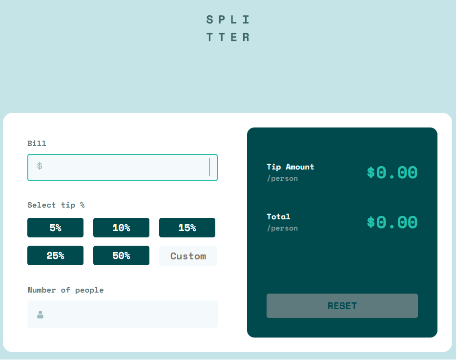
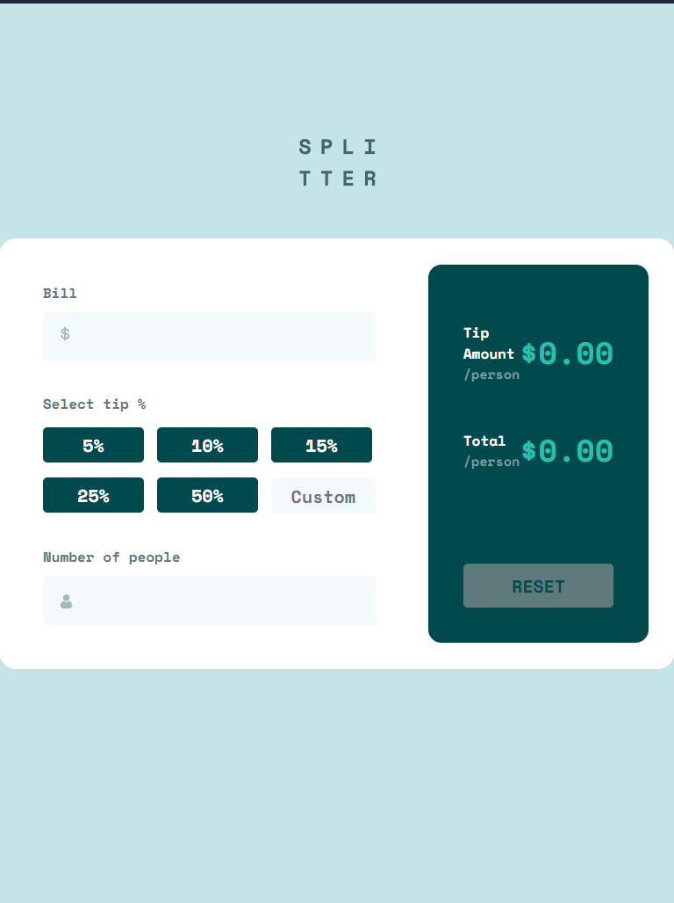
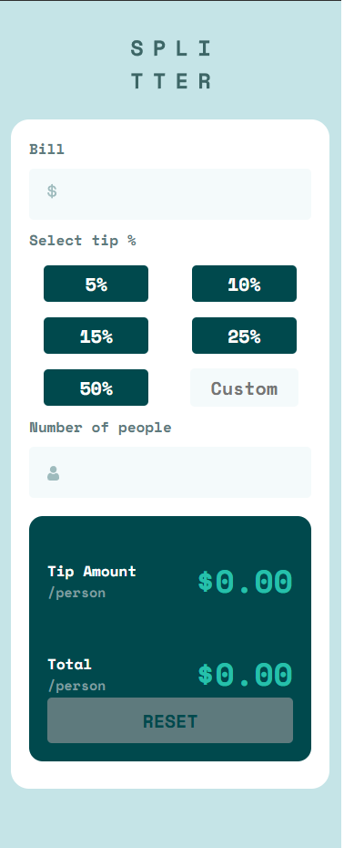

# Frontend Mentor - Tip calculator app solution

This is a solution to the [Tip calculator app challenge on Frontend Mentor](https://www.frontendmentor.io/challenges/tip-calculator-app-ugJNGbJUX). Frontend Mentor challenges help you improve your coding skills by building realistic projects.

## Table of contents

- [Overview](#overview)
  - [The challenge](#the-challenge)
  - [Screenshot](#screenshot)
  - [Links](#links)
- [My process](#my-process)
  - [Built with](#built-with)
  - [What I learned](#what-i-learned)

## Overview

### The challenge

Users should be able to:

- View the optimal layout for the app depending on their device's screen size
- See hover states for all interactive elements on the page
- Calculate the correct tip and total cost of the bill per person

### Screenshot





### Links

- Solution URL: [Add solution URL here](https://github.com/tortiman/tip_calculator_app)
- Live Site URL: [Add live site URL here](https://tortiman.github.io/tip_calculator_app/)

## My process

### Built with

- Semantic HTML5 markup
- CSS custom properties
- Flexbox
- CSS Grid
- Mobile-first workflow

### What I learned

I am improving my responsive design understanding best the responsive design. I learned how to split in diferents functions the code in javascript.

To see how you can add code snippets, see below:

```css
@media (max-width: 400px) {
  body {
    display: flex;
    flex-direction: column;
    height: auto;
  }

  .container {
    margin-top: 130px;
    width: auto;
    height: auto;
    display: flex;
    flex-direction: column;
    justify-content: center;
  }

  .container .quantities {
    width: 310px;
    margin: 0;
    gap: 10px;
  }

  .quantities .percentage .gridButtons {
    width: 310px;
    display: grid;
    grid-template-columns: 1fr 1fr;
    grid-template-rows: 1fr 1fr 1fr;
    justify-content: space-between;
    align-items: center;
    justify-items: center;
  }

  .screen {
    margin: 0 20px 30px 20px;
    padding: 0;
    width: 310px;
  }

  .screen .screen-container {
    padding: 20px;
  }

  .bill .people {
    width: auto;
  }

  .logo {
    top: 5%;
  }
}
```

```js
document.addEventListener("DOMContentLoaded", () => {
  const moneyId = document.getElementById("moneyId");
  const customId = document.getElementById("customId");
  const errorId = document.getElementById("errorId");
  const numberPeopleId = document.getElementById("numberPeopleId");
  const quantityPersonId = document.getElementById("quantityPersonId");
  const totalQuantityId = document.getElementById("totalQuantityId");
  const resetId = document.getElementById("resetId");

  let percentage = "";
  let valuePercentage = 0;
  // let valueCustom=0;
  /* --- LISTENERS ---*/

  const gridButtons = document.querySelectorAll(".button-normal");
  let buttonPressed = false;

  gridButtons.forEach(function (button) {
    button.addEventListener("click", function () {
      gridButtons.forEach(function (btn) {
        btn.style.backgroundColor = "hsl(183, 100%, 15%)";
      });
      buttonPressed = true;
      button.style.backgroundColor = "hsl(172, 67%, 45%)";
      percentage = button.textContent;
      console.log("boton presionado en grid", button.textContent);
      principal();
    });
  });

  moneyId.addEventListener("input", () => {
    if (validatorNumberNoZeroOrNegative(moneyId.value)) {
      principal();
    } else {
      resetScreen();
    }
  });

  numberPeopleId.addEventListener("input", () => {
    if (numberPeopleNoZeroOrNegative(numberPeopleId.value)) {
      errorId.style.visibility = "hidden";
    } else {
      errorId.style.visibility = "visible";
      principal();
    }
  });

  resetId.addEventListener("click", () => {
    resetScreen();
  });

  customId.addEventListener("input", () => {
    if (customNoZeroOrNegative(customId.value)) {
      percentage = customId.value;
      principal();
    }
  });

  /* --- END LISTENERS --- */

  /* --- PRINCIPAL FUNCTION ---*/

  function principal() {
    if (
      validatorNumberNoZeroOrNegative(moneyId.value) &&
      numberPeopleNoZeroOrNegative(numberPeopleId.value) &&
      (pressButton() || customNoZeroOrNegative(customId.value))
    ) {
      console.log("entra en la funcion principal", totalPerson());
      totalQuantityId.textContent = `$${totalPerson()}`;
      quantityPersonId.textContent = `$${tipAmountPerson()}`;
    } else {
      console.log("No se cumplen todas las condiciones");
    }
  }

  /* --- END PRINCIPAL FUNCTION ---*/

  /** --- HELPERS FUNCTIONS --- */

  function totalPerson() {
    // const total=0;
    console.log(percentage);

    if (percentage === "5%") {
      valuePercentage = 1.05;
    } else if (percentage === "10%") {
      valuePercentage = 1.1;
    } else if (percentage === "15%") {
      valuePercentage = 1.15;
    } else if (percentage === "25%") {
      valuePercentage = 1.25;
    } else if (percentage === "50%") {
      valuePercentage = 1.5;
    } else {
      valuePercentage = parseInt(percentage) / 100 + 1;
      console.log(valuePercentage);
    }
    console.log("porcentaje antes del retorno", valuePercentage);
    return ((moneyId.value * valuePercentage) / numberPeopleId.value).toFixed(
      2
    );
  }

  function tipAmountPerson() {
    console.log(valuePercentage);
    return (
      (moneyId.value * valuePercentage - moneyId.value) /
      numberPeopleId.value
    ).toFixed(2);
  }

  function resetScreen() {
    moneyId.value = "";
    numberPeopleId.value = "";
    quantityPersonId.textContent = "$0.00";
    totalQuantityId.textContent = "$0.00";
    gridButtons.forEach(function (button) {
      button.style.backgroundColor = "hsl(183, 100%, 15%)";
    });
  }

  /** --- END HELPERS FUNCTIONS --- */

  /** --- VALIDATORS FUNCTIONS */

  function validatorNumberNoZeroOrNegative(value) {
    return !isNaN(value) && Number(value) > 0;
  }
  function numberPeopleNoZeroOrNegative(number) {
    return !isNaN(number) && Number(number) > 0;
  }

  function pressButton() {
    return buttonPressed;
  }

  function customNoZeroOrNegative(value) {
    console.log(value);
    return !isNaN(value) && Number(value) > 0;
  }

  /** ---END VALIDATORS FUNCTIONS */
});
```
